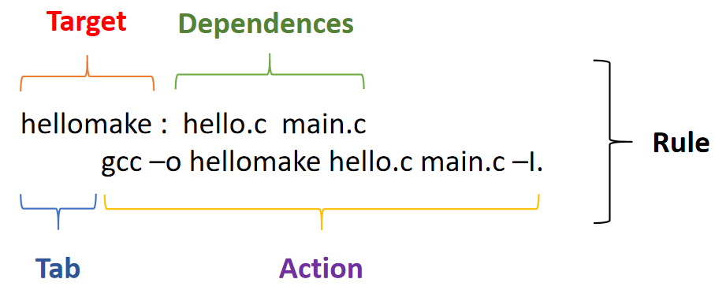

# General Knowledge
## I. Makefile
### 1. Makefile là gì
\- tác dụng
\- Makefile bao gồm filel Makefile và các file .mk
### 2. rule trong Makefile
- cấu trúc một rule

\- Target :
\- Dependences :
\- Actions :

- Gọi rule trong Makefile   
``` Makefile
 make rule
```
- Gọi một rule trong *.mk
``` Makefile
 make -f *mk rule
```

### 3. Comment trong Makefile
```Makefile
# comment trong Makefile
``` 
### 4. Include *.mk trong Makefile
```Makefile
include *.mk
```
``note``  tương tự giống include trong C
### 5. Ký tự đặc biệt 
``` Makefile
CC := gcc
FLAG := -I ./
DST := execute
all : hello.c main.c
    $(CC) -o $(DST) $S^ $(FLAG) 
# - $(CC) => giá trị trong biến CC 
# - $@    => target 
# - $<    => giá trị bên trái cùng của dependences 
# - $^    => giá trị bên trong dependences 
```

### 6. Biến trong Makefile
- Phép gán trong Makefile

``` Makefile
var = "var"
var3 ?= "var3"

var1 = $(var)
var2 := $(var)
var3 ?= $(var)

var = "change value"

rule:
    @echo "var1 = $(var1)" #in giá trị của biến var1
    @echo "var2 = $(var2)" #in giá trị của biến var2
    @echo "var3 = $(var3)" #in giá trị của biến var3
```
\- `` kết quả khi gọi rule ``
|biến|giá trị|
|:--:|:-----:|
|var1|"change value"|
|var2|  "var"|
|var3|  "var3"|

\- ``giải thích:`` \
var1 \= \$\(var) $\to$ var1 được gán đệ quy nghĩa là var1 bằng giá trị của biến var tại thời điểm lần cuối cùng biến var thay đổi \
var2 \:\= \$\(var) $\to$ var2 được gán trực tiếp nghĩa là giá trị của var2 = \$(var) tại thời điểm gán và không thay đổi đến khi biến var2 được gán lại \
var3 \?\= \$\(var) $\to$ nếu var3 chưa được khởi tạo thì var3 giống với trường hợp var1. Nếu var3 được khởi tạo giá trị var3 sẽ không đổi đến khi được gán lại 
### 7. .PHONY
\- trường hợp trong folder tồn tại các file trùng tên với các rule đã đặt trong Makefile khi này ta không thể gọi được các rule bình thường. .PHONY được sử dụng để giải quyết các trường hợp này
``` Makefile
PHONY := rule1
rule1 :
# rule1
PHONY += rule2
rule2 :
# rule2
...
.PHONY PHONY
```
### 8. implicit rules và explicit rules
``` Makefile

```
## II. C compiling procress
- quá trình biên dịch C thông qua 4 bước : \

### 1. Pre-Processor
- mã nguồn biến đổi file *.c thành *.i
- loại bỏ các comments
- mở rộng các macros
- mở rộng các inclue file
- biên dịch các câu lệnh điều kiện
```Makefile
Pre_Processor_stage:
    gcc -E *.c -o *.i  
```
### 2. Compiler
- mã nguồn biến đổi các file *.i thành assembly file *.s
```Makefile
Compiler_stage:
    gcc -S *.i -o  *.S
```
### 3. Assembler
- Thông qua Assembler assembly file *.s thu được một file mã máy *.o. file mã máy này được mã hóa nhị phân
```Makefile
Assembler_stage:
    gcc -c *.S -o *.o 
```
### 4. Linker
- Sau quá trình Assembler, Một project tạo ra nhiều file *.o. Các file *.o được linking kết quả tạo thành file thực thi *.exe
```Makefile
Linker_stage:
    gcc -o *.o ... *.o
```
## III. Static and Shared library
### 1. Variadic functions

``` C
int function(int count, ...);
```
### 2. đặc điểm chung của Static lib và Shared lib
- Thư viện là một tập hợp các đoạn mã được biên dịch sẵn để có thể được sử dụng lại trong một chương trình.
- Được chia ra làm 2 loại: Static lib và Shared lib

### 3. tạo ra Static lib và Shared lib
1. static library
``` Makefile
# compiling all file *.c to machine file *.o (assembiler)
obj:
    gcc -o *.o -c *.c
     
# Creating Libraries :: Static Library Setup
static:
    ar rcs libmylib.a objfile_1.o ... objfile_n.o

link:
    gcc -o output obj.o -L lib_Path -l lib_name
```
2. shared library
``` Makefile
obj:
    gcc -fPIC -o *.o -c *.c
# Creating Libraries :: shared Library Setup
shared:
    gcc -share -o Path/*.so *1.o *2.o ... *n.o 

link:
    gcc main.o -L LIB_Path -l lib_name -o output
```
- docs:
\- creating library in c: https://randu.org/tutorials/c/libraries.php#:~:text=Creating%20Libraries%20%3A%3A%20Static%20Library%20Setup%201%20First,4%20That%20is%20all%20that%20is%20required.%20
