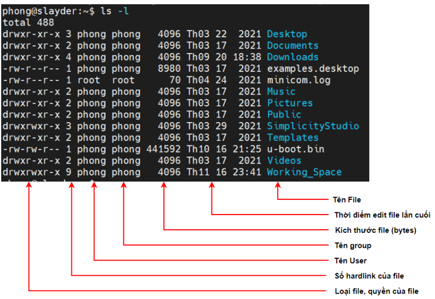
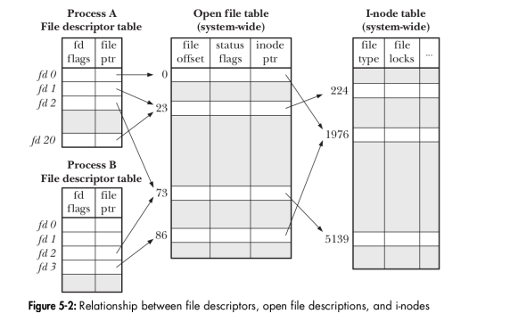
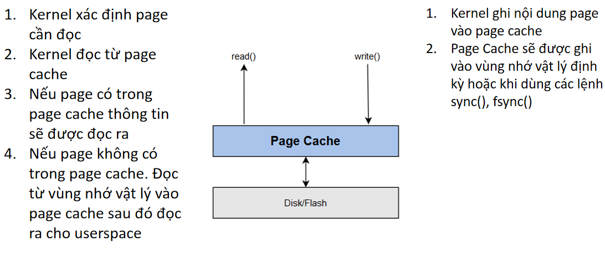

# Linux File System
## I. Tổng quan về File trên Linux
- Linux quản lý tất cả mọi thứ như một file.

### 1. Các loại file trên linux
- Regular file: là các file thông thường như text file,executable file.
- Directories file: file chứa danh sách các file khác.
- Character Device file: file đại diện cho các thiết bị không có địa chỉ vùng nhớ.
- Block Device file: file đại diện cho các thiết bị có địa chỉ vùng nhớ.
- Link files: file đại diện cho một file khác.
- Socket file: file đại diện cho 1 socket.
- Pipe file: file đại diện cho 1 pipe 
### 2. Hiển thị thông tin file

- các thành phần cơ bản của một file bao gồm 
\- tên file
\- thời điểm chỉnh sửa file lần cuối
\- tên group
\- tên user
\- số hardlink của file
\- loại file, quyền truy nhập của file
1. tên file
2. thời điểm chỉnh sửa file lần cuối
3. tên group
4. tên user
5. số hardlink của file
6. loại file, quyền của file \

- loại file bao gồm : \
\- '-' : Regular file \
\- 'd' : Directories file \
\- 'c' : Character Device file \
\- 'b' : Block Device file \
\- 'l' : Link files \
\- 's' : Socket file \
\- 'p' : Pipe file 
- các quyền của file chia ra làm 3 phần:\
u(user) | g(group) | o(other)
- quyền truy nhập cơ bản cơ bản của file bao gồm:\
r(read)\<bit2> | w(write)\<bit1> | x(execute)\<bit0>
### 3. Chỉnh sửa quyền truy nhập của file trong linux
- thêm hoặc giảm quyền truy nhập
``` Makefile
chmod u-r file  # bỏ quyền r(read) của user
chmod o+w file  # thêm quyền w(write) của other
chmod g-x file  # bỏ quyền execute của group

chmod u-0666 file  
```
- thay đổi user group
``` Makefile
sudo chown group(:user) file
```
## II. đọc ghi file trong linux
\- kernel cung cấp một số system call cơ bản như: open, read, write, lseek, close
1. open
``` C
    int open(const char *path, int flags, mode_t mode);
    /*
    @param[path]  : đường dẫn đến file muốn mở
    @param[flags] : 
        - O_CREAT :
        - O_RDONLY
        - O_WRONLY
        - O_RDWR
    //@param[mode]  : 
    @return       : file decrition
    */
```
2. read
``` C
    ssize_t read(int fd, void *buffer, size_t count);
    /*
        @param[fd]
        @param[buffer]
        @param[count]
    */
```
4. write
``` C
    ssize_t write(int fd, void *buffer, size_t count);
```
5. lseek
``` C
    off_t lseek(int fd, off_t offset, int whence);
```
6. close
``` C
    int close(int fd);
```
## III. quản lý file trong linux
 \
\- Kernel điều khiển việc tương tác giữa tiến trình và file thông qua ba bảng: File descriptor table ,Open file table, I-node table
1. i-node table
\- mỗi phần tử trong inode table đại diện cho 1 file chưa thông tin file đó
3. open file table
4. file decription table

\- Khi tiến trình dùng lệnh read()/write()
* để tránh làm hỏng bộ nhớ do nhiều lần đọc ghi file trực tiếp với ổ nhớ cứng => đọc ghi file qua một page cache \

* có thể đọc trực tiếp thông qua system call
## IV. File locking
### 1. Ứng dụng 
- File locking dùng để quản lý việc nhiều tiến trình cùng đọc/ghi vào 1 file
### 2. Cách hoạt động 
- Bước 1: Ghi trạng thái lock vào I-node của file.
- Bước 2: Nếu thành công thì thực hiện đọc ghi file, nếu không thành công nghĩa là file đang được tiến trình khác sử dụng.
- Bước 3: Sau khi đọc/ghi xong gỡ trạng thái lock ra khỏi I-node của file.
### 3. file lock System call
- Kernel cung cấp 2 system call để quản lý locking file

1. flock
- Flock dựa vào thông tin file descriptor để đặt trạng thái lock vào i-node table.
``` C
    int flock(int fd, int operation);
    /*
    fd : file decriptor của file cần lock
    operation :
        - LOCK_SH: nếu set giá trị này thành công tiến trình có thể đọc file, không ghi.
        - LOCK_EX: nếu set giá trị này thành công tiến trình có thể đọc ghi file.
        - LOCK_UN: set giá trị này để báo file không bị lock.
        - LOCK_NB: nếu không dùng flag này hàm flock sẽ không kết thúc cho tới khi set được lock.
    */
```


2. fcntl
``` C
    int fcntl(int fd, int op, ... /* arg */ );
    /*  
    fd : file decriptor của file cần lock
    cmd: action muốn thực hiện
        - F_SETLK: đặt lock, bỏ lock
        - F_GETLK: đọc thông tin lock
        - flockstr: struct chứa thông tin muốn lock 
    */
    struct flock { 
        short l_type;   /* Lock type: F_RDLCK, F_WRLCK, F_UNLCK */ 
        short l_whence; /* How to interpret 'l_start': SEEK_SET, SEEK_CUR, SEEK_END */
        off_t l_start;  /* Offset where the lock begins */ 
        off_t l_len;    /* Number of bytes to lock; 0 means "until EOF" */
        pid_t l_pid;    /* Process preventing our lock (F_GETLK only) */
    }
```


