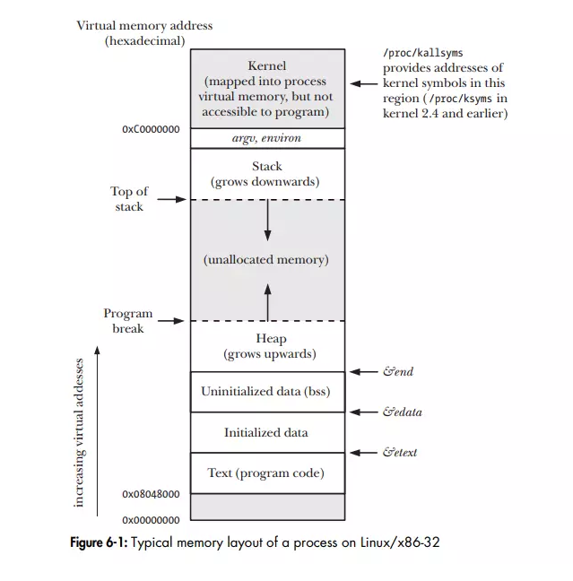
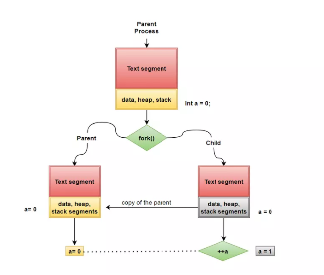
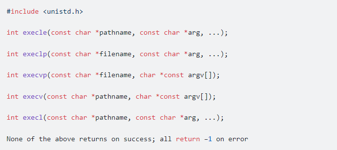
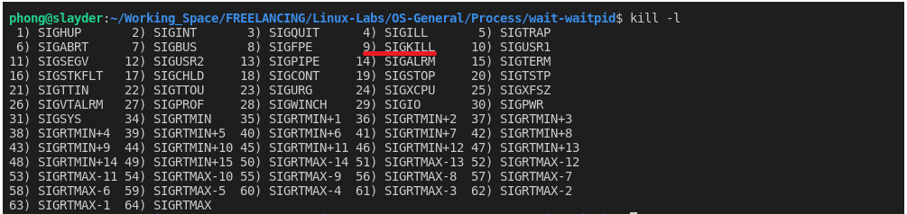

# Process
## I. Giới thiệu chung
\- Chương trình(Program) và tiến trình(Process) là hai thuật ngữ liên quan tới nhau:
- Chương trình(program): là một nhóm các câu lệnh thực thi một nhiệm cụ thể, được thể hiện bằng các file thực thi và nằm trên ổ cứng máy tính.
- Tiến trình(Process):Tiến trình là một chương trình đang được thực thi và sử dụng tài nguyên của hệ thống
- Mỗi một process có một mã dùng để định danh gọi là process ID (PID), đây là số nguyên dương và duy nhất cho mỗi process trên hệ thống. Sử dụng system call getpid() để lấy process ID

## II. Command-line Arguments
\- Mỗi một chương trình đều bắt đầu khởi chạy từ hàm main().
\- Khi chạy chương trình, các tham số môi trường (command-line arguments) sẽ được truyền qua hai đối số trong hàm main().
- argc : Số lượng tham số truyền vào hàm main():
- argv[] : Mảng con trỏ trỏ tới các tham số được truyền cho chương trình đó. 

``` C
int main(int argc, char *argv[])
{
    // code
    ...
}
```

## III. Memory layout của Process
\- Bộ nhớ cấp phát cho mỗi một process được chia thành nhiều phần khác nhau. Thông thường chúng được gọi là các segments (các phân đoạn vùng nhớ). \

### 1. Text segment 
- Chứa các chỉ lệnh ngôn ngữ máy (machine-language) của program
-  Segment này có quyền read-only.
### 2. Initialized data segment
- Bao gồm các biến global và biến static đã được khởi tạo một cách tường minh.
- Segment này có quyền read, write
### 3.Uninitialized data segment
- Bao gồm các biến global và biến static không được khởi tạo tường minh.
- Segment này có quyền read, write.
### 4.Stack segment
- Có thể co dãn vùng nhớ bằng cách cấp phát hoặc giải phóng các stack frames.
- Segment này có quyền read, write.
### 5. Heap segment
- Segment dành cho việc cấp phát bộ nhớ một cách tự động. Sử dụng các hàm như alloc(), malloc(), calloc().
- Heap có thể co dãn tương tự stack. Điểm kết thúc của Heap được gọi là program break.
- Segment này có quyền read, write.

## IV. Thao tác với Process
### 1. Tạo một tiến trình mới.
- Tiến trình init là tiến trình đầu tiên được chạy, là cha của mọi tiến trình khác và có process id là
- Sử dụng system call fork() để tạo ra tiến trình con mới.
- Tiến trình gọi fork() được gọi là tiến trình cha mẹ (parent process).
- Tiến trình mới được tạo ra gọi là tiến trình con (child process)
``` C
    pid_t fork(void);
    /*
        @return
            - < 0 : không tạo ra tiến trình
            - = 0 : trả về cho tiến trình con mới
            - > 0 : trả về cho tiến trình cha. chứa giá trị Process id của tiến trình con 
    */
```

### 2. Chạy một tiên trình mới
- Trong nhiều trường hợp bạn đang có một tiến trình A đang thực thi và bạn muốn chạy một chương trình B nào đó từ tiến trình A hoặc con của nó. Điều này hoàn toàn có thể thực hiện được thông qua việc sử dụng một danh sách các hàm thuộc dòng exec. \

```C
// example : chạy command line trong linux ls -lah
int main(void)
{
    ... // code 
    execl("/bin/ls", "ls", "-l", "-a", "-h", NULL);
}
```
\- ``giải thích``

### 3. Kết thúc tiến trình
1. Kết thúc bình thường (normally termination) 
- Một process có thể hoàn thành việc thực thi của nó một cách bình thường bằng cách gọi system call _exit() hoặc dùng hàm exit().
``` C
int _exit(int status);

int exit(int status);
```
2. Kết thúc bất thường(abnormally termination)
- Một process có thể bị kết thúc bằng cách sử dụng command-line kill hoặc system call kill trong stdsignal.h trong linux \

```linux bash
kill -l  /-> hien thi SIGNAL_Number
kill -SIGNAL_Number PID_number
```
``` C
void kill(pid_t pid, int SIG_FLAG);
/*
    @prama[SIG_FLAG]: tín hiệu cờ chứa trong <signal.h>
*/
```
## V. Quản lý tiến trình
### 1. System call wait() 
``` C
pid_t wait(int *status);
/*
    @return : trả về pid của tiến trình con nếu thành công. Trả về -1 nếu lỗi 
*/
```
### 2. System call waitpid()
``` C
pid_t waitpid(pid_t pid, int *status, int options);
/*
    @prama[pid]
        - < -1: Chờ bất kỳ tiến trình con nào có ID nhóm tiến trình bằng với giá trị tuyệt đối của pid. 
        - = -1: chờ bất cứ tiến trình con nào 
        - = 0 : Chờ bất kỳ tiến trình con nào có ID nhóm tiến trình bằng với ID của tiến trình gọi.
        - > 0 : Chờ tiến trình con có ID tiến trình bằng với giá trị của pid
    @prama[status]  : chứa giá trị status 
    @prama[options]
        - WNOHANG: Quay lại ngay lập tức nếu không có trẻ nào thoát ra.
        - WUNTRACED: Cũng quay lại nếu trẻ đã dừng lại.
        - WCONTINUED: Cũng quay lại nếu trẻ đã dừng lại đã được tiếp tục bằng cách giao SIGCONT.
    @return : trả về pid của tiến trình con nếu thành công. Trả về -1 nếu lỗi
*/
```
### 3. Status Macros
``` C
WIFEXITED(status)       // trả về nếu tiến trình con kết thúc bình thường
WEXITSTATUS(status)     // Trả về trạng thái thoát của tiến trình con 
WIFSIGNALED(status)     // Trả về true nếu tiến trình con bị kết thúc bởi tín hiệu 
WTERMSIG(status)        // Trả về giá trị tín hiệu khiến tiến trình con kết thúc.
WIFSTOPPED(status)      // Trả về true nếu tiến trình con bị dừng do nhận được tín hiệu.
WSTOPSIG(status)        // Trả về giá trị tín hiệu khiến tiến trình con dừng lại
WIFCONTINUED(status)    // Trả về true nếu tiến trình con được tiếp tục bằng cách phân phối SIGCONT
``` 
## VI. Tiến trình Orphane và Zombie
- Vòng đời của các tiến trình cha - con thường không giống nhau. Tiến trình cha sống lâu hơn tiến trình con và ngược lại. Điều này đặt ra hai câu hỏi. 
- Tiến trình cha kết thúc trước tiến trình con, lúc này tiến trình con rơi vào trạng thái mồ côi cha (orphane), vậy ai sẽ là cha mới của nó ?

- Điều gì xảy ra nếu tiến trình con kết thúc trước khi tiến trình cha kịp gọi wait() ?
### 1. Tiến trình Orphane
- Nếu tiến trình cha kết thúc trong khi một hoặc nhiều tiến trình con của nó vẫn đang chạy, khi đó các tiến trình con đó sẽ trở thành các tiến trình mồ côi (orphane). 
- Tiến trình mồ côi sẽ được chấp nhận bởi tiến trình init (có PID 1), và tiến trình init sẽ hoàn thành công việc thu thập trạng thái cho chúng.
### 2. Tiến trình Zombie
- Nếu tiến trình con kết thúc trước tiến trình cha được tạo ra, nó không hoàn toàn được giải phóng khỏi hệ thống mà rơi vào trạng thái Zombie. 
- Lúc này tài nguyên dành cho tiến trình được giải phóng và chỉ giữ lại một số thông tin cơ bản như PID, trạng thái kết thúc tiến trình.
Tiến trình bị xóa khỏi hệ thống khi tiến trình cha gọi wait() hoặc waitpid().
- Điều này khiến ngốn tài nguyên của hệ điều hành
### 3. Ngăn ngừa tiến trình Zombie
- Có một bảng process ID (PID) cho mỗi hệ thống. Kích thước của bảng này là hữu hạn.
- Nếu quá nhiều tiến trình zombie được tạo, thì bảng này sẽ đầy. Tức là hệ thống sẽ không thể tạo ra bất kỳ tiến trình mới nào, khi đó hệ thống sẽ đi đến trạng thái ngưng hoạt động. 
1. sử dụng wait()/waitpid()
- luôn hiện gọi wait()/waitpid() ở tiến trình cha
- note : các system call trên sẽ luôn chờ đến khi nhận được tín hiệu kết thúc. Điều này khiến bộ nhớ không hoạt động hiệu quả
3. Sủ dụng SIGCHILD
- Khi tiến trình con kết thúc, một tín hiệu SIGCHILD sẽ được gửi tới tiến trình cha của nó.
``` C
void func(int signum)
{
    wait(NULL);
}
Parent Process
{
    .../* code */
    signal(SIGCHLD, func);
}

/* 
- System call signal() sẽ đăng ký một hàm sử lý tín hiệu cho tín hiệu SiGCHLD 
- Hàm func là hàm xử lý tín hiệu mà bạn muốn gọi khi tín hiệu SIGCHLD được nhận
*/
```


