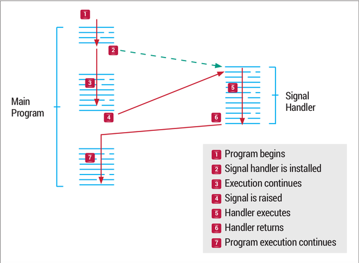

# Signal in Linux
## I. Giới thiệu
### 1. Định nghĩa
- Signal là một trong những phương thức dùng để giao tiếp liên tiến trình lâu đời nhất của Unix System.
- Signal là một software interrupt, là cơ chế xử lý các sự kiện bất đồng bộ (async).
- ví dụ \
\- Những sự kiện này có thể bắt nguồn từ bên ngoài như khi người dùng nhấn tổ hợp phím Ctrl+C. Hoặc từ các hoạt động trong chương trình như phép chia một số cho 0.
### 2. Signal Lifecycle
- Generation: Đầu tiên một tín hiệu signal được raised/sent/generated.
- Delivery: Một signal được pending cho tới khi nó được phân phối.
- Processing: Một khi tín hiệu được phân phối, nó có thể được xử lý bởi nhiều cách. \
\- Ignore the signal: Không action nào được thực hiện. SIGKILL và SIGSTOP không thể bị ignore.
\- Catch and handle the signal: Kernel sẽ tạm dừng thực thi main thread và nhảy tới hàm xử lý signal được user đăng kí trong process (signal handler). SIGINT và SIGTERM là hai signal thường được dùng. SIGKILL và SIGSTOP không thể catch.
\- Perform the default action: hành động này đã được định nghĩa săn 


## II. Signal Handler
- Chúng ta đăng kí việc xử lý một signal thông qua system call signal().
- Signal là một software interrupt nên nó khá nhạy cảm về mặt thời gian thực thi. Khi signal handler được thực thi nó sẽ chiếm hoàn toàn cpu của process. Cần phải thoát ra hàm xử lý signal nhanh nhất có thể.
``` C
__sighandler_t signal (int __sig, __sighandler_t __handler)

void __handler(int signo)
{
    // implement code here
}
```


## III. Một số signal cơ bản
- SIGKILL   : 	Chỉ có thể gửi bằng system call kill(). Process không thể caught hoặc ignored. Mặc định sẽ kết thúc tiến trình được chỉ định.
- SIGTERM: 	Chỉ có thể gửi bằng system call kill(). Mặc định sẽ kết thúc tiến trình được chỉ định, tuy nhiên process có thể catch tín hiệu này và dọn dẹp trước khi kết thúc.
- SIGINT    : 	Tín hiệu này được gửi tới các process trong nhóm foreground process. Mặc định sẽ kết thúc tiến trình hiện tại.
- SIGCHLD: 	Bất cứ khi nào một tiến trình dừng lại, nó sẽ gửi SIGCHLD tới process cha của nó. Mặc định SIGCHLD bị ignored.
- SIGSTOP : 	Chỉ có thể gửi bằng system call kill(). Process không thể caught hoặc ignored. Mặc định sẽ tạm dừng process được chỉ định.
- SIGUSR1/SIGUSR2: Signals có sẵn cho người dùng tự định nghĩa.

## IV. Sending Signals
- Signal có thể gửi được qua hàm system call kill() trong mã nguồn.
- Ngoài ra có thể gửi thông qua command kill trên terminal. Có thể tự gửi signal đến bản thân tiến trình đó thông qua việc sử dụng hàm getpid().
``` C
int kill (pid_t pid, int signo);

```

## V. Blocking và unblocking signal
1. Khái niệm:
- TSignal làm gián đoạn quá trình thực thi của process. Điều này trong nhiều trường hợp không được mong muốn xảy ra khi process đang thực thi một số đoạn mã quan trọng. Blocking signal sẽ giúp giải quyết vấn đề này.
- Mỗi một process có thể chỉ định signal cụ thể nào mà nó muốn block. Nếu signal bị block vẫn xảy ra thì nó sẽ được kernel giữ vào hàng chờ xử lý (pending).
- Tín hiệu chỉ được gửi tới process sau khi nó được unblocking. 
- Danh sách các signal bị block được gọi là signal mask được mô tả bởi struct sigset_t
2. Signal sets:
``` C
int sigfillset (sigset_t *set); // 
int sigemptyset (sigset_t *set); // 
int sigaddset (sigset_t *set, int signo); // 
int sigdelset (sigset_t *set, int signo); // 
int sigismember (const sigset_t *set, int signo); // 

struct 
{
    unsigned long sig[_NSIG_WORDS];
}sigset_t;
```
- sigfillset : block toàn bộ signal trong signal table (set 1 cho toàn bộ signal trong signal table)
- sigemptyset : unblock toàn bộ signal trong signal table (set 0 cho toàn bộ signal trong signal table)
- sigaddset : block signo trong signal table(set 1 cho signo)
- sigdelset : unblock signo trong signal table(set 0 cho signo)
- sigismember : kiểm tra xem signo có bị block hay không(=1 -> block/ =0 -> unblock/ =-1 -> false)
1. Blocking Signals: 
``` C
int sigprocmask(int how, const sigset_t *newset, sigset_t oldset);
/*
@param[how]:
- SIG_SETMASK: signal mask của process sẽ bị ghi đè bở newset.
- SIG_BLOCK: nếu signo trong signal mask của process không block(=0) mà signo trong newset được set(=1) thì signo này trong signal mask process sẽ bị block
- SIG_UNBLOCK: đặt unblock cho signo nào được set trong newset
@param[newset]: yêu cầu thay đổi cho signal mask của process.
@param[oldset]: signal mask của process.
*/
```
`` note `` \
\- lấy ra signal mask hiện tại bằng cách sử dụng sigprocmask(int how, NULL, sigset_t *olset). signal mask sẽ được lưu trong olset


