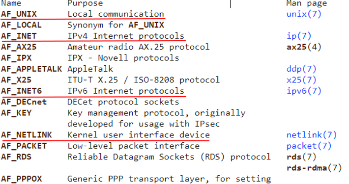
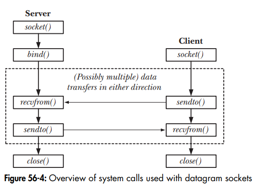

# Socket in linux
## I. Giới thiệu
### 1. Định nghĩa
- Socket là cơ chế truyền thông cho phép các tiến trình có thể giao tiếp với nhau dù các tiến trình ở trên cùng thiết bị hay khác thiết bị.
- Có thể có Socket như một file và nó được đại diện bởi một file socket descriptor.
- Thông tin được mô tả trong một file socket sẽ gồm: Domain, Type, Protocol.
### 2. Domain
- Tiến trình cần giao tiếp nằm trên cùng thiết bị hay khác thiết bị. Socket có 2 domain chính là: Internet Domain và UNIX Domain.

### 3. Type
- Mô tả cơ chế truyền nhận thông tin
- Socket có 2 type phổ biến là: Stream(TCP) và Datagram(UDP) 

| Stream Socket | Datagram Socket |
|:-------------|:----------------|
|Tin cậy ( đảm bảo dữ liệu nhận được theo thứ tự, có thông báo nếu lỗi xảy ra)| Không tin cậy ( dữ liệu nhận được có thể không theo thứ tự, dữ liệu có thể mất trong quá trình truyền mà không có thông báo)|
|Yêu cầu tạo kết nối trước khi trao đổi dữ liệu|Không cần tạo kết nối trước khi trao đổi dữ liệu. Dữ liệu có thể được gửi đi ngay cả khi tiến trình đích không tồn tại.|
|Thường dùng khi dữ liệu cần truyền là chuỗi bit|Thường dùng nếu dữ liệu cần truyền là các gói tin|

### 4. Protocol
- Cách thức đóng gói dữ liệu.
- Từ Domain và Type sẽ có một danh sách các protocol tương ứng để ta lựa chọn.
- Thông thường với một Domain và Type đã chọn chỉ có 1 giao thức có thể dùng nên protocol thường có giá trị 0.


## II. Flow hoạt động
### 1. Flow hoạt động của Stream Socket
- Stream socket yêu cầu tạo một kết nối trước khi truyền dữ liệu.
- Tiến trình khởi tạo kết nối đóng vai trò là client, tiến trình nhận được yêu cầu kết nối là server.


### 2. Flow hoạt động của Datagram Socket
- Trong Datagram socket vai trò của client và server khá mờ nhạt. 
- Về cơ bản các tiến trình có thể gửi dữ liệu đến một địa chỉ bất kể địa chỉ đó có tồn tại hay không.
- Trong quá trình truyền nhận ta tạm coi tiến trình muốn gửi dữ liệu là client và tiến trình nhận dữ liệu là server.


## III. Sockets: Internet Domain socket
### 1. Internet Socket Address
- Dùng để giao tiếp giữa các tiến trình nằm trên các thiết bị khác nhau.
- Domain: AF_INET/AF_INET6
- Socket chỉ có một kiểu địa chỉ duy nhất là sockaddr
- Tuy nhiên để tiện cho việc sử dụng với từng domain socket khác nhau người ta định nghĩa thêm các struct địa chỉ riêng cho từng domain sau đó sẽ ép kiểu về struct socaddr.
``` C
struct sockaddr {
	sa_family_t  sa_family;     /* address family, AF_xxx	*/
	char a_data[14];            /* 14 bytes of protocol address*/
};
```
#### IPv4 Socket Address

``` C
struct sockaddr_in {         
    sa_family_t sin_family;  	/* Address family (AF_INET) */ 
    in_port_t sin_port;      	/* Port number */ 
    struct in_addr sin_addr; 	/* IPv4 address */ 
    unsigned char __pad[X];  	/* Pad to size of 'sockaddr' structure (16 bytes) */
};

struct in_addr {            	/* IPv4 4-byte address */ 
    in_addr_t s_addr;       	 /* Unsigned 32-bit integer */
};
```
#### IPv6 Socket Address
``` C
struct sockaddr_in6 { 
    sa_family_t sin6_family;   	/* Address family (AF_INET6) */ 
    in_port_t sin6_port;       	/* Port number */ 
    uint32_t sin6_flowinfo;    	/* IPv6 flow information */ 
    struct in6_addr sin6_addr; 	/* IPv6 address */ 
    uint32_t sin6_scope_id;    	/* Scope ID (new in kernel 2.4) */
};

struct in6_addr {              	/* IPv6 address structure */ 
    uint8_t s6_addr[16];       	/* 16 bytes == 128 bits */
};
```
### 2 Chuyển đổi địa chỉ Socket
- Địa chỉ của Internet Socket được đặc trưng bởi địa chỉ IP và port. Chúng đều được lưu trữ trên thiết bị dưới dạng số integer.
- Các thiết bị sử dụng các kiến trúc phần cứng khác nhau sẽ lưu trữ địa chỉ theo thứ tự khác nhau.
- socket sử dụng một quy ước chung về cách lưu trữ địa chỉ gọi là network byte order ( thật ra là theo thứ tự của Big-endian)

[!image](socket_InternetEndian.png)

### 3. Các hàm được sử dụng chuyển đổi địa chỉ Socket
``` C
#include <arpa/inet.h>
uint16_t htons(uint16_t host_uint16);
    Returns host_uint16 converted to network byte order
 
uint32_t htonl(uint32_t host_uint32);
    Returns host_uint32 converted to network byte order

uint16_t ntohs(uint16_t net_uint16);
    Returns net_uint16 converted to host byte order

uint32_t ntohl(uint32_t net_uint32);
    Returns net_uint32 converted to host byte order
```

## IV. 4. Sockets: Unix Domain
### 1. Internet Socket Address

- Linux hỗ trợ Internet Socket để giao tiếp giữa các tiến trình trên cùng một thiết bị.
- Tuy Internet Socket cũng có thể truyền thông trên cùng thiết bị nhưng Unix socket nhanh và dễ sử dụng hơn.
- Domain là AF_UNIX
- UNIX Domain Socket hỗ trợ 2 loại socket chính là:
\- SOCK_STREAM (stream)
\- SOCK_DGRAM (datagram).
- Protocol luôn là 0.
\- socket(AF_UNIX, SOCK_STREAM, 0)
### 2. Unix Socket Address
- Sau khi chạy bind() để gán địa chỉ cho socket một socket file sẽ được tạo theo path_name

``` C
struct sockaddr_un {
    sa_family_t sun_family;    /* Always AF_UNIX */
    char sun_path[108];          /* Null-terminated socket pathname */
};
```

- Không thể gán một socket vào một path_name đã tồn tại.
Một path_name chỉ có thể được gán cho một socket.
- Path_name có thể là đường dẫn tuyệt đối (/home/phonglt/path_name) hoặc tương đối (./path_name)
- Tuy socket được đặc trưng bởi một socket file nhưng ta không thể dùng open() để kết nối socket.
- Sau khi socket được đóng hay chương trình đã tắt file path_name vẫn còn. Nếu muốn xóa file này ta có thể dùng unlink() hoặc remove().
- Để kết nối hoặc gửi dữ liệu tới socket yêu cầu tiến trình phải có quyền write với file path_name. 
- Lệnh bind() sẽ tạo socket file với đầy đủ các quyền cho tất cả tài khoản nhưng ta có thể thay đổi quyền hạn của chúng bằng umask() hoặc đơn giản là thay đổi quyền của thư mục chứa file socket


## V. System call 
### 1. System call socket
``` C
#include <sys/socket.h>

int socket(int domain, int type, int protocol);
/*
    @param[domain]   : tên miền UNIX/IPv4/IPv6
    @param[type]     : SOCK_DGRAM/SOCK_STREAM
    @param[protocol] : 0 

    @retval : trả về socket file description 
*/
```
### 2. System call bind
``` C
int bind(int sockfd, const struct sockaddr *addr, socklen_t addrlen);
/*
    @param[sockfd]  : file description của socket file 
    @param[addr]    : 
    @param[addrlen] : addrlen chỉ định kích thước, tính bằng byte, 
    của cấu trúc địa chỉ được trỏ tới bởi addr.

    @retval: thành công trả về 0, lỗi trả về -1 và errno được set để chỉ ra lỗi 
*/
struct sockaddr {
    sa_family_t sun_family;    /* AF_UNIX: unix, AF_INET: IPv4, AF_INET6: IPv6 */
    char sun_path[108];        /* socket pathname */
};
``` 
### 3. System call listen
``` C
int listen(int sockfd, int backlog);
/*
    @param[sockfd]  : file description của socket file có kiểu SOCK_STREAM / SOCK_SEQPACKET.
    @param[backlog] : xác định độ dài tối đa mà hàng đợi các kết nối đang chờ xử lý cho sockfd.
    
    @retval: thành công trả về 0, lỗi trả về -1 và errno được set để chỉ ra lỗi 
*/
```
### 4. System call accept
``` C
int accept(int sockfd, struct sockaddr *_Nullable restrict addr, socklen_t *_Nullable restrict addrlen);
/*
    @param[sockfd]  : file description của socket file có kiểu SOCK_STREAM / SOCK_SEQPACKET.
    @param[addr]    : là một con trỏ có kiểu struct sockaddr
    @param[addrlen] : giá trị chứa size của addr

    @retval: thành công trả về 0, lỗi trả về -1 và errno được set để chỉ ra lỗi 
*/
```
### 5. System call connect
``` C
int connect(int sockfd, const struct sockaddr *addr, socklen_t addrlen);
/*
    @param[sockfd]  : file description của socket file có kiểu SOCK_STREAM / SOCK_SEQPACKET.
    @param[addr]    : là một con trỏ có kiểu struct sockaddr
    @param[addrlen] : giá trị chứa size của addr

    @retval: thành công trả về 0, lỗi trả về -1 và errno được set để chỉ ra lỗi 
*/
```
### 6. System call sendto
``` C
ssize_t sendto(int sockfd, const void *buf, size_t len, int flags, const struct sockaddr *dest_addr, socklen_t addrlen);
/*
    @param[sockfd]  : file description của socket file có kiểu SOCK_STREAM / SOCK_SEQPACKET.
    @param[addr]    : là một con trỏ có kiểu struct sockaddr
    @param[addrlen] : giá trị chứa size của addr

    @retval : thành công trả về 0, lỗi trả về -1 và errno được set để chỉ ra lỗi
*/
```
### 7. System call recvfrom
``` C
ssize_t recvfrom(int sockfd, void buf[restrict .len], size_t len, int flags, struct sockaddr *_Nullable restrict src_addr, socklen_t *_Nullable restrict addrlen);
/*
    @param[sockfd]: file description của socket file
    @param[buf]: dữ liệu nhận được
    @param[len]: độ dài tối đa nhận được
    @param[flags]: 
    @param[src_addr]: 
    @param[addrlen]:  

    @retval : thành công khi trả về số byte nhận được, trả về -1 nếu thất bại
*/
```
### 8. System call setsockopt
- Hàm setsockopt() sẽ đặt tùy chọn được chỉ định bởi đối số option_name, ở cấp độ giao thức được chỉ định bởi đối số level, thành giá trị được trỏ tới bởi đối số option_value cho socket được liên kết với trình mô tả tệp được chỉ định bởi đối số socket.ile description của socket 
``` C
int setsockopt(int socket, int level, int option_name, const void *option_value, socklen_t option_len);
/*
    @param[socket] : file description của socket file
    @param[level]  : 
    @param[option_name] : 
    @param[option_value] :
    @param[option_len] :
    
    @retval
*/
```
### 9. System call inet_ntop
``` C
const char *inet_ntop(int af, const void *restrict src, char dst[restrict .size], socklen_t size);
/*
    @param[af]
    @param[src]
    @param[dst]
    @param[size]

    @retval
*/
```


