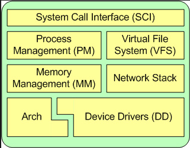
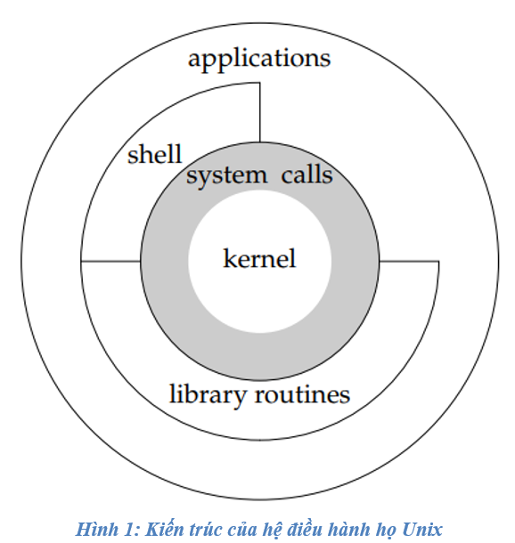
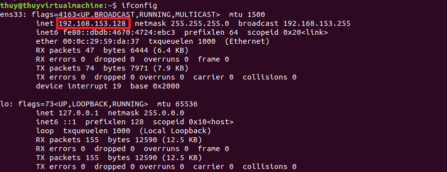

# Linux-Programming-N-System
## I. Document
- Tutorial:
  - [Linux Programming and System](https://youtube.com/playlist?list=PL831drV1RoWunpiXBC442qlY9FIkMepNI&si=nFdjX6ziMydDbfYV)
- Book: The linux programming interface
## II. Giới thiệu chung về hệ điều hành Linux
### 1. Hệ điều hành UXIN
- Ra đời vào năm 1973.
- Áp dụng rất nhiều lý thuyết toán học để tối ưu hoạt động.
- Được thiết kế để mở rộng cho các máy tính tương lai.
- Được kế thừa từ rất nhiều hệ điều hành hiện nay như Window, MacOS, Linux,…
- Lập trình trên Linux rất giống với Unix.

### 2. Chức năng chính của OS
- OS là chương trình đầu tiên được chạy, nó sở hữu và có toàn quyền quyết định đối với các thành phần khác của hệ thống. Scheduling, memory management, file system,…

### 3. Kiến trúc của  Linux OS
- Việc phân chia các lớp của hệ điều hành phụ thuộc vào từng góc nhìn.

## III. Giao thức SSH và SFTP
### 1. SSH 
- SSH viết đầy đủ là Secure Shell, đây là một giao thức hỗ trợ các nhà quản trị mạng truy cập vào máy chủ từ xa thông qua mạng internet không bảo mật. Ngoài ra, SSH còn cung cấp các bộ tiện ích phục vụ phát triển chính giao thức SSH 
- SSH tạo ra cơ chế xác thực qua mật khẩu mạnh, hình thành mối liên kết giao tiếp dữ liệu mã hóa ra giữa hai máy qua môi trường internet. Ngày nay giao thức SSH được giấy quản trị mạng sử dụng phổ biến trong quá trình quản lý, điều chỉnh ứng dụng từ xa. Nó cho phép vị tự đăng nhập vào mạng máy tính và thực hiện một số tác vụ cơ bản như dịch chuyển file 
### 2. SFTP 
- SFTP là từ viết tắt của Secure File Transfer Protocol, hoặc SSH File Transfer Protocol. Đây là một giao thức mạng giúp bạn có thể upload hoặc download dữ liệu trên máy chủ. Bạn cũng có thể sử dụng giao thức này để sửa, tạo hoặc xóa các tập tin và thư mục trên máy chủ Linux 
### 3. Cấu hình trên Vscode
1.  Lấy IP  

3. Cài extension SFTP 
4. Tổ hợp phím CTRL + P $\to$ chọn SFTP:config
5. Cấu hình trên sftp.json file 
``` c
    "name": "My Server",
    "host": "192.168.153.128",                      -> ip của máy ảo 
    "protocol": "sftp",                             -> tên giao thức 
    "port": 22,     
    "username": "thuy",                             -> tên máy ảo 
    "remotePath": "/home/thuy/Desktop/MyWorkspace", -> đường đẫn file muốn truyền
    "uploadOnSave": true,
    "useTempFile": true,
    "openSsh": true
```
## III. Command line
1. List file
2. change directory
3. remove
4. Current Working Directory
5. vim
6. cat
7. tree 
8. top 
9. ps aux| grep ten_process

### IV. Document
[Playlist Youtube](https://www.youtube.com/playlist?list=PL831drV1RoWunpiXBC442qlY9FIkMepNI)

### V. Mục lục
[1. General Knowledge](https://github.com/thuyhoh/Linux_Programming_N_System/tree/master/1-General-Knowledge) \
[2. file system ](https://github.com/thuyhoh/Linux_Programming_N_System/tree/master/2-Linux-File-System) \
[3. Process ](https://github.com/thuyhoh/Linux_Programming_N_System/tree/master/3-Process) \
[4. Thread ](https://github.com/thuyhoh/Linux_Programming_N_System/tree/master/4-thread) \
[5. Signal ](https://github.com/thuyhoh/Linux_Programming_N_System/tree/master/5-signal) \
[6. Socket ](https://github.com/thuyhoh/Linux_Programming_N_System/tree/master/6-socket) \
[7. Pipes FIFOs](https://github.com/thuyhoh/Linux_Programming_N_System/tree/master/7-pipes-FIFOs) \
[8. Shared memory](https://github.com/thuyhoh/Linux_Programming_N_System/tree/master/8-shared-memory) \
[9. Semaphore](https://github.com/thuyhoh/Linux_Programming_N_System/tree/master/9-semaphore) \
[10. message Queues](https://github.com/thuyhoh/Linux_Programming_N_System/tree/master/10-message-queues) \
[11. Kernal module basic]() 

 
